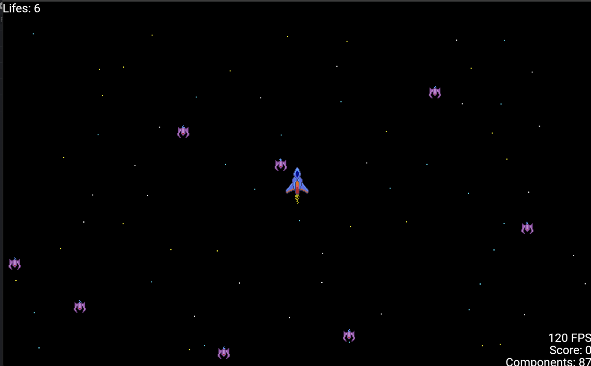

# Space Rogue

**Space Rogue** est un jeu vidéo développé avec le moteur [Flame](https://flame-engine.org) et le framework [Flutter](https://flutter.dev). Inspiré par un exemple présent dans la documentation officielle de Flame, ce projet a pour objectif de démontrer comment créer un jeu complet en s'appuyant sur les fonctionnalités et les bonnes pratiques offertes par Flame.



## Fonctionnalités

- **Gameplay inspiré du rogue-like spatial :** Déplacement, gestion d’ennemis et interactions dans un univers spatial.
- **Utilisation de Flame :** Démonstration de l’utilisation du moteur pour gérer les boucles de jeu, les composants, les collisions et les animations.
- **Gestion d’assets :** Chargement et utilisation d’images, sons et autres ressources intégrées à Flutter.
- **Architecture modulaire :** Organisation du code en composants et classes dédiés facilitant l’extension et la maintenance du jeu.

## Prérequis

- **Flutter SDK :** Assurez-vous d’avoir une version récente de Flutter installée. Vous pouvez suivre [ce guide d’installation](https://flutter.dev/docs/get-started/install).
- **Dart :** La version de Dart fournie avec Flutter est suffisante.
- Un **émulateur** ou un **appareil physique** (Android/iOS) pour exécuter l’application.

## Installation

1. **Cloner le dépôt :**

   ```bash
   git clone https://github.com/b-fontaine/space_rogue.git
   ```

2. **Se placer dans le répertoire du projet :**

   ```bash
   cd space_rogue
   ```

3. **Installer les dépendances Flutter :**

   ```bash
   flutter pub get
   ```

## Exécution du jeu

Pour lancer le jeu en mode debug :

```bash
flutter run
```

Pour compiler et exécuter le jeu en mode release (pour de meilleures performances) :

```bash
flutter run --release
```

## Structure du projet

Voici un aperçu de l’organisation du code (la structure peut évoluer) :

- **lib/**
    - `main.dart` : Point d'entrée de l’application. Ce fichier initialise Flutter et lance le jeu.
    - **game/** : Contient la logique principale du jeu (classe dérivée de `FlameGame` ou similaire) et la configuration de la boucle de jeu.
    - **components/** : Regroupe les différents composants du jeu (joueur, ennemis, projectiles, décor, etc.). Chaque composant gère son propre comportement et son affichage.
- **assets/** : Dossier dédié aux ressources (images, sons, fichiers de configuration) utilisées par le jeu.
- **pubspec.yaml** : Fichier de configuration Flutter pour la gestion des dépendances et l’enregistrement des assets.

_Note : La structure exacte peut être adaptée au fil des évolutions du projet._

## Personnalisation et extensions

Le code a été conçu pour être facilement extensible. N’hésite pas à :

- **Ajouter de nouveaux composants** : Par exemple, de nouveaux types d’ennemis ou des éléments d’interface supplémentaires.
- **Modifier la logique de jeu** : Pour adapter le gameplay à de nouvelles idées ou pour expérimenter différentes mécaniques.
- **Optimiser les performances** : En ajustant la gestion des assets ou en améliorant les routines de collision/animation.

## Contribution

Les contributions sont les bienvenues ! Si vous souhaitez :

- Proposer des améliorations,
- Corriger des bugs,
- Ajouter de nouvelles fonctionnalités,

merci de créer une [issue](https://github.com/b-fontaine/space_rogue/issues) pour en discuter ou directement de soumettre une pull request.

## Licence

Ce projet est distribué sous licence [MIT](LICENSE). Vous êtes libre de l’utiliser et de le modifier selon les termes de cette licence.
